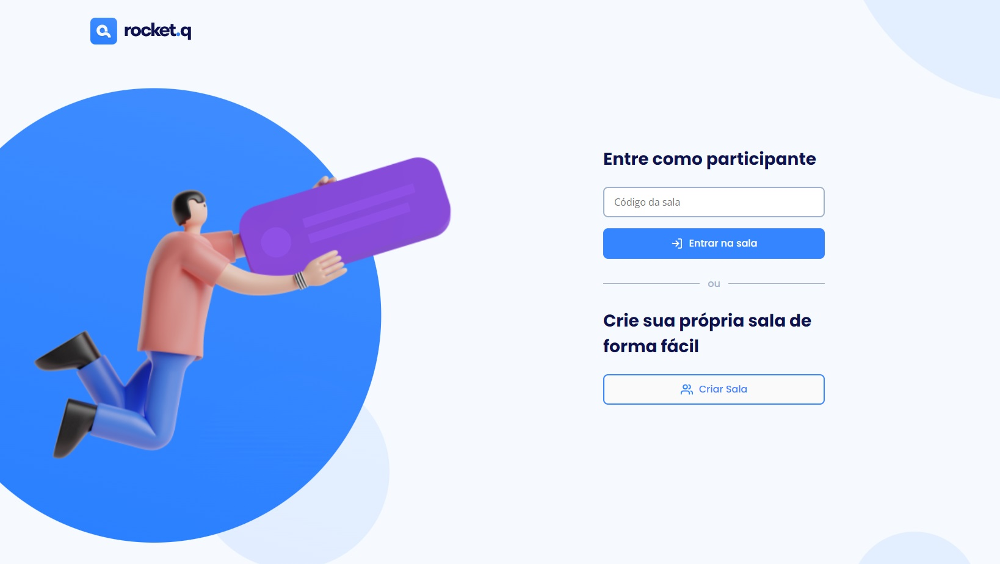
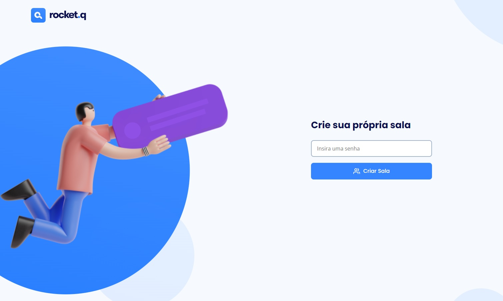
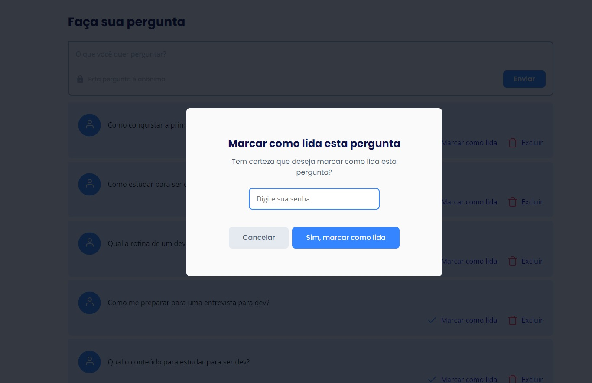
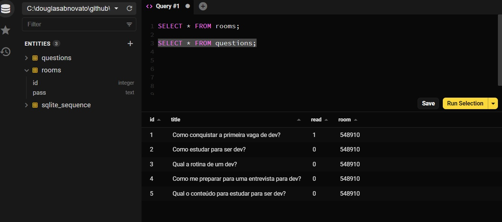

<h1 align="center">
  
</h1>

  <a href="#-tecnologias">Tecnologias</a>&nbsp;&nbsp;&nbsp;|&nbsp;&nbsp;&nbsp;
  <a href="#-projeto">Projeto</a>&nbsp;&nbsp;&nbsp;|&nbsp;&nbsp;&nbsp;
  <a href="#-layout">Layout</a>&nbsp;&nbsp;&nbsp;|&nbsp;&nbsp;&nbsp;
  <a href="#memo-licença">Licença</a>

 

  

 

  

## 🚀 Tecnologias

Esse projeto foi desenvolvido com as seguintes tecnologias:

- HTML, CSS e JavaScript
- EJS
- NodeJS
- Express
- SQLite

## 🎨 Layout - v1.0 - fluxo da aplicação e estrutura no bd

- A home da aplicação podendo criar uma sala ou entrar em uma sala já existente

  

 

- Se optar por criar a própria sala, criar uma senha.

  

 

- Se optar por entrar em uma sala, inserir o código. Então verá as perguntas e poderá fazer outras.

  

 

- Se for o criador da sala, poderá marcar como lida as perguntas.

  

 

- Visualizando as questões no banco de dados

  

 

## 💻 Projeto

O Rocket.Q é uma aplicação de interação através de perguntas, sendo possível criar uma sala para internautas anônimos fazerem perguntas e o criador da sala em posse de uma senha gerenciar essas perguntas e marcar como lidas.

## 💻 Detalhes do Projeto
- criar banco: `npm run init-db`
- Beekeeper para conferir informações e estrutura do banco de dados

## 🔖 Detalhes no Notion

Podemos ver mais detalhes do projeto através [desse link](https://www.notion.so/Mission-Discover-f103a00f5ca74e78ad4df757a142bbf7) no Notion.

## 🔖 Layout

Você pode visualizar o layout do projeto através [desse link](https://www.figma.com/community/file/1009821158959690135/Roquet.q). É necessário ter conta no [Figma](https://figma.com) para acessá-lo.

- seguir o design

  

## :memo: Licença

Esse projeto está sob a licença MIT. Veja o arquivo [LICENSE](.github/LICENSE.md) para mais detalhes.

---  

Feito com ❤️ por Douglas A B Novato 👋🏽 [Entre em contato!](https://www.linkedin.com/in/douglasabnovato/).