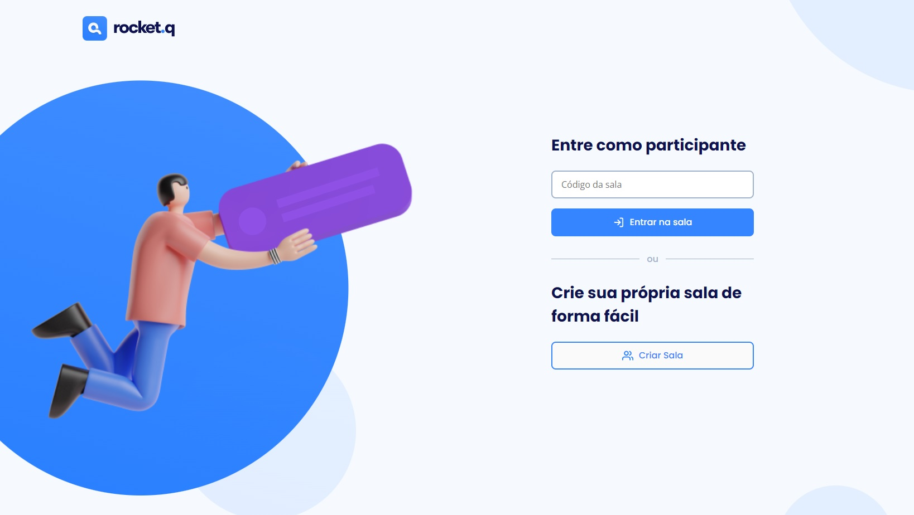
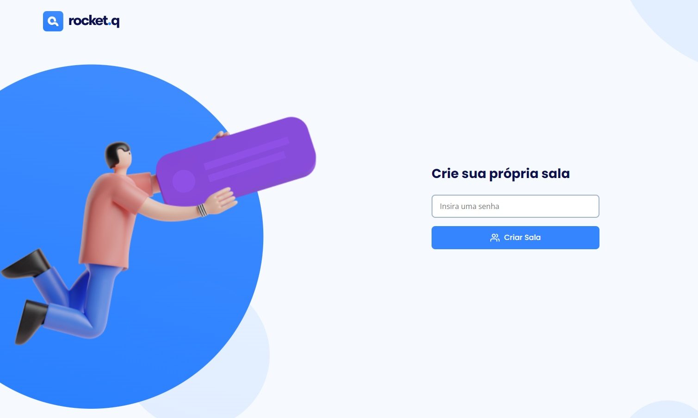
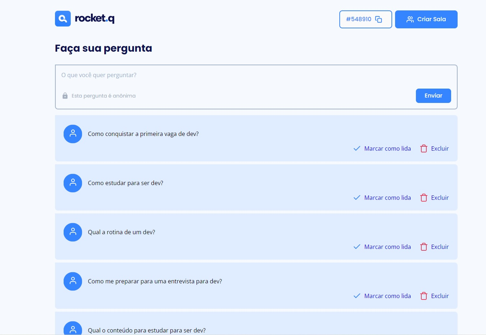
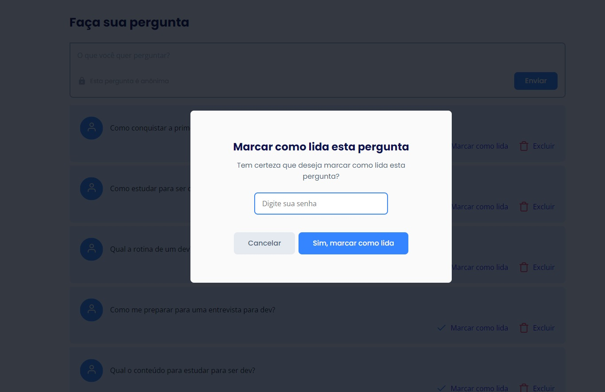
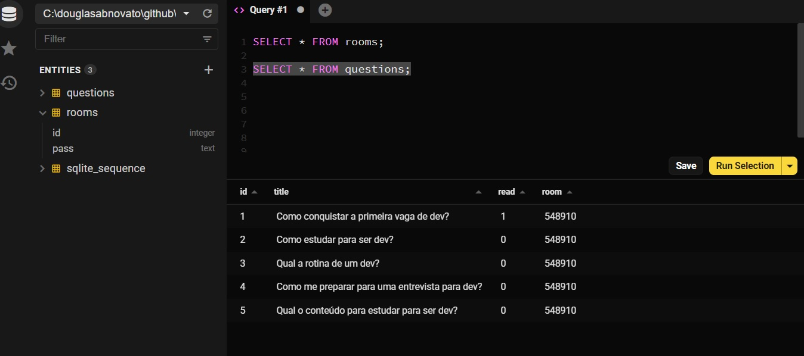
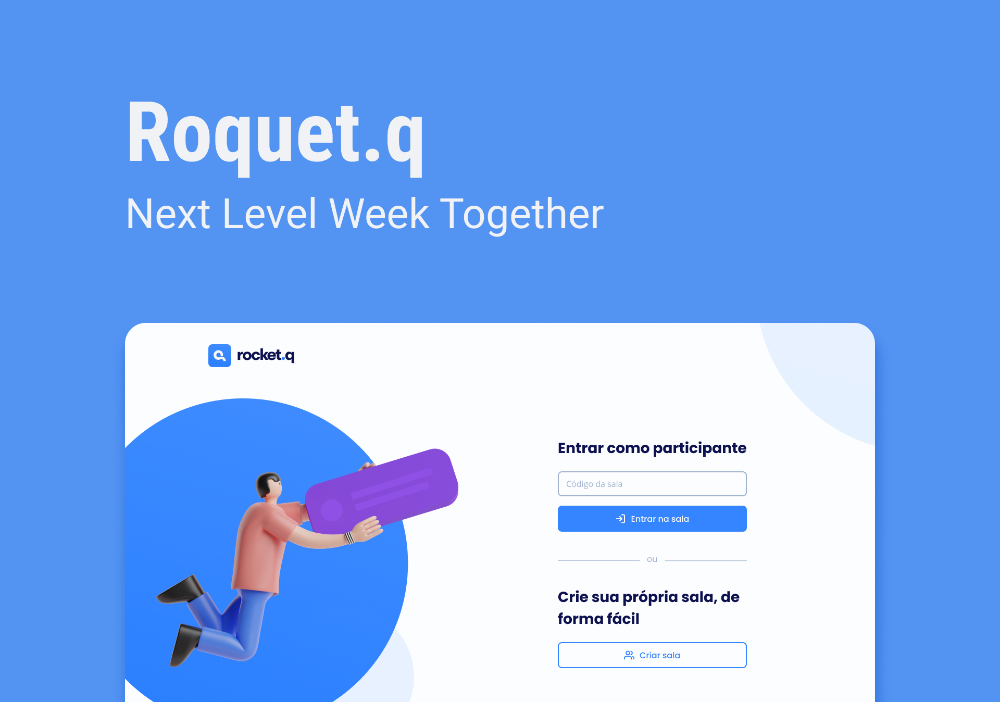

> **Projeto de estudo (N1).** Estado conferido em 16/11/2026: roda localmente seguindo este README, com testes no CI. Ainda não há link publicado deste código (#17). Estado em [docs/MVP.md](docs/MVP.md).

<h4 align="center"> 
  Rocket.Q 🚀
</h4> 

<p align="center">
  
</p>

<p align="center">
  <a href="#-tecnologias">Tecnologias</a>&nbsp;&nbsp;&nbsp;|&nbsp;&nbsp;&nbsp;
  <a href="#%EF%B8%8F-como-executar">Como executar</a>&nbsp;&nbsp;&nbsp;|&nbsp;&nbsp;&nbsp;
  <a href="#-projeto">Projeto</a>&nbsp;&nbsp;&nbsp;|&nbsp;&nbsp;&nbsp;
  <a href="#-layout">Layout</a>&nbsp;&nbsp;&nbsp;|&nbsp;&nbsp;&nbsp;
  <a href="#memo-licença">Licença</a>
</p>

<p align="center">
 

  
</p>

<br>

## 🧠 O que aprendi

> Proposta de 01/11/2026, escrita a partir do código e das dependências. Ajuste com a sua experiência.

- Renderizar salas e perguntas no servidor com Express e EJS.
- Proteger salas com senha usando `bcryptjs`.
- Guardar dados em SQLite com `better-sqlite3`.
- Limitar abuso com `express-rate-limit` e testar com `node --test`.

## Estado e próximos passos (ciclo de 16/11/2026)

**O que foi feito**
- 16/11/2026, PR [#16](https://github.com/douglasabnovato/rocket-q/pull/16): teste do fluxo no navegador (Playwright) com axe e teclado, no job `e2e` do CI (#11).
- 16/11/2026, PR [#16](https://github.com/douglasabnovato/rocket-q/pull/16): a lista de perguntas se atualiza a cada 15 s sem recarregar e anuncia "1 pergunta nova." (#10).
- 16/11/2026: o README deixou de citar `https://rocket-q.onrender.com` como demonstração. O endereço responde, mas serve outro HTML, que não é o da `main` (#17).
- 10/11/2026, PRs #14 e #15: `main` protegida pelo ruleset `principal-protegida`.
- 06/11/2026, PRs #12 e #13: `nodemon` trocado por `node --watch` (`npm audit` sem alertas) e CI nos PRs para `developer/**`.
- `docs/MVP.md`: 9 de 10 critérios aplicáveis em 16/11/2026, **Finalizado** (o critério 9 depende de ligar os alertas do Dependabot, #18).

**O que queremos fazer**
- [#8](https://github.com/douglasabnovato/rocket-q/issues/8) Votar nas perguntas ("também quero saber").
- [#9](https://github.com/douglasabnovato/rocket-q/issues/9) Moderação opcional antes de mostrar a pergunta.
- [#19](https://github.com/douglasabnovato/rocket-q/issues/19) Atualizar as dependências para as versões maiores atuais.
- Com o responsável: [#17](https://github.com/douglasabnovato/rocket-q/issues/17) publicar pelo Blueprint do Render, [#18](https://github.com/douglasabnovato/rocket-q/issues/18) ligar os alertas do Dependabot e [#20](https://github.com/douglasabnovato/rocket-q/issues/20) exigir o check `e2e` na `main`.

**Onde está a documentação**
- [docs/MVP.md](docs/MVP.md): critérios, evidências e estado.
- [docs/PLANO-DE-ACAO.md](docs/PLANO-DE-ACAO.md): seção "Ciclo de 16/11/2026", com análise, pesquisa, backlog e engenharia.
- [docs/DEPLOY.md](docs/DEPLOY.md): passo a passo da publicação no Render.

## 💻 Projeto

O Rocket.Q é uma aplicação de interação através de perguntas, sendo possível criar uma sala para internautas anônimos fazerem perguntas e o criador da sala em posse de uma senha gerenciar essas perguntas e marcar como lidas.

## ▶️ Como executar

Pré-requisito: Node.js 20 ou superior.

```bash
npm install
npm run dev          # desenvolvimento com recarga automática (node --watch)
npm start            # produção: node src/server.js
npm test             # 18 testes de integração (node:test + supertest)
npx playwright install chromium   # uma vez, para o teste no navegador
npm run test:e2e     # fluxo no navegador com Playwright e axe (sobe o servidor sozinho, porta 3471)
npm run init-db      # opcional: cria/atualiza o banco; o servidor já faz isso ao subir
```

Variáveis de ambiente (veja `.env.example`; para carregar localmente use `node --env-file=.env src/server.js`):

| Variável | Padrão | Uso |
|---|---|---|
| `PORT` | `3000` | Porta HTTP |
| `DATABASE_FILE` | `src/db/rocketq.sqlite` | Arquivo do SQLite |
| `BCRYPT_COST` | `10` | Custo do hash da senha da sala |
| `TRUST_PROXY` | `0` | Use `1` atrás de proxy (Render, alwaysdata) para o limite de tentativas por IP |

O banco antigo (senha em texto puro) é migrado automaticamente na primeira subida: as senhas viram hash bcrypt e as perguntas órfãs são descartadas. Para conferir o banco, o Beekeeper Studio continua funcionando.

### Rotas

| Método | Rota | O que faz |
|---|---|---|
| GET | `/` | Entrar numa sala pelo código |
| GET | `/create-pass` | Formulário para criar sala |
| POST | `/create-room` | Cria a sala (senha de 6 a 72 caracteres) |
| POST | `/enterroom` | Valida o código e abre a sala |
| GET | `/room/:room` | Perguntas da sala (não lidas primeiro) |
| GET | `/room/:room/questions.json` | Mesma lista em JSON (só id e texto), que a sala consulta a cada 15 s |
| POST | `/question/create/:room` | Envia pergunta anônima (1 a 500 caracteres) |
| POST | `/question/:room/:question/:action` | `check` ou `delete`, exige a senha da sala |

### Hospedagem gratuita

Ainda sem link publicado deste código: a publicação pelo Blueprint é do responsável (#17).

- **Render (web service free)**, configurado em `render.yaml`: build `npm ci`, start `npm start`, `TRUST_PROXY=1`. O serviço dorme após 15 min sem acesso (~1 min para acordar) e o disco é apagado a cada deploy/reinício, então as salas são temporárias.
- **alwaysdata (plano gratuito, 100 MB):** alternativa com disco persistente, se as salas precisarem durar.
- Passo a passo completo: [docs/DEPLOY.md](docs/DEPLOY.md).

## 📊 Estado do MVP & Documentação

| Documento | Conteúdo |
|---|---|
| [docs/ANALISE.md](./docs/ANALISE.md) | Requisitos, diagnóstico (OWASP, WCAG, 12-Factor), rubrica e critérios de aceite BDD |
| [docs/ARQUITETURA.md](./docs/ARQUITETURA.md) | C4, camadas, modelo de dados em 3FN, contrato de rotas e ADRs |
| [docs/PLANO-DE-ACAO.md](./docs/PLANO-DE-ACAO.md) | Tarefas priorizadas por MoSCoW e ganho ÷ esforço |

| Momento | Nota MVP | Situação |
|---|---|---|
| Antes (27/09/2026) | 3,50 | Reprovado — injeção de SQL, senha em texto puro e exclusão de perguntas de outra sala |
| Depois (27/09/2026) | 8,40 | Aprovado |


## 🚀 Tecnologias

Esse projeto foi desenvolvido com as seguintes tecnologias:

- HTML, CSS e JavaScript (módulos ES no navegador)
- EJS (renderização no servidor)
- Node.js 20+ e Express 4
- SQLite com `better-sqlite3`
- `bcryptjs`, `helmet` e `express-rate-limit`
- Testes com `node:test` e `supertest`; no navegador, Playwright com `@axe-core/playwright`

## 🎨 Layout - v1.0 - fluxo da aplicação e estrutura no bd

- A home da aplicação podendo criar uma sala ou entrar em uma sala já existente
<p align="center" style="display: flex; align-items: flex-start; justify-content: center;">
  
</p> 

- Se optar por criar a própria sala, criar uma senha.
<p align="center" style="display: flex; align-items: flex-start; justify-content: center;">
  
</p> 

- Se optar por entrar em uma sala, inserir o código. Então verá as perguntas e poderá fazer outras.
<p align="center" style="display: flex; align-items: flex-start; justify-content: center;">
  
</p> 

- Se for o criador da sala, poderá marcar como lida as perguntas.
<p align="center" style="display: flex; align-items: flex-start; justify-content: center;">
  
</p> 

- Visualizando as questões no banco de dados
<p align="center" style="display: flex; align-items: flex-start; justify-content: center;">
  
</p> 

## 🔖 Detalhes no Notion

Podemos ver mais detalhes do projeto através [desse link](https://www.notion.so/Mission-Discover-f103a00f5ca74e78ad4df757a142bbf7) no Notion.

## 🔖 Layout

Você pode visualizar o layout do projeto através [desse link](https://www.figma.com/community/file/1009821158959690135/Roquet.q). É necessário ter conta no [Figma](https://figma.com) para acessá-lo.

- seguir o design
<p align="center">
  
</p> 

---

### Próximo passo para frontend

- [x] 1. responsividade (uma coluna abaixo de 768 px)
- [x] 2. acessibilidade (WCAG 2.2 AA verificada com axe-core)
- [ ] 3. modo dark / light
- [ ] 4. variação de cores
- [ ] 5. hospedar aplicação

---

## :memo: Licença

Esse projeto está sob a licença MIT. Veja o arquivo [LICENSE](.github/LICENSE.md) para mais detalhes.

---  

Feito com ❤️ por Douglas A B Novato 👋🏽 [Entre em contato!](https://www.linkedin.com/in/douglasabnovato/).

Fonte do projeto: [NLW Together Edição 6 na trilha Mission: Discover da Rocketseat](https://github.com/maykbrito) 
